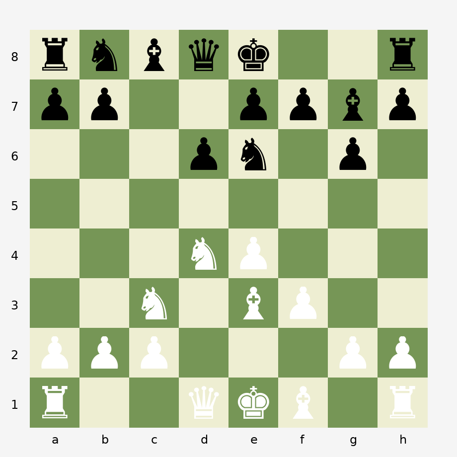

## Praxisbeispiel
Ein angehender Ernährungstherapeut erhält im Praktikum die Aufgabe einen Flyer zum Thema Endometriose zu erstellen.
Nach einer Stunde hat er mit Hilfe von KI einen Flyer erstellt. Der Flyer ist inhaltlich korrekt, optisch ansprechend und spricht die vorgegebene Zielgruppe angemessen an. 

> Ist dies ein Beispiel für angemessene Nutzung von KI im Rahmen eines Praktikums? 

## Was macht KI mit... 

::::{.columns}

:::{.column width="50%"}
### Produktion

KI verbessert die *Leistung* bei kognitiven Aufgaben

- Berater:innen mit GPT-4: 40% bessere Ergebnisse bei komplexen Aufgaben
- Wissenschaftler:innen: mehr und bessere Forschungsideen mit KI-Unterstützung
- Software-Entwickler:innen: schnellere Aufgabenerledigung

:::

:::{.column width="50%"}
### Lernen

::: {style="display: flex; align-items: center; justify-content: center; height: 350px;"}
[?]{style="font-size: 280px; font-weight: bold; line-height: 1; color: #1E3A5F;"}
:::
:::

::::

## Lernen braucht kognitive Anstrengung - Begründung 1

- Aktives Erinnern (=anstrengend) festigt gelerntes.

> Studie von Karpicke & Roediger (*Science*, 2008)
> Probanden, die in einer Übungsphase wiederholt getestet wurden (aktives erinnern) erinnerten später mehr als Probanden, die statt dessen das Material wiederholten (passives Verarbeiten)

## Lernen braucht kognitive Anstrengung - Begründung 2

Wo ist der Fehler? 

<div style="position: relative; display: inline-block;">

<div class="fragment">
<div style="position: absolute; left: 51.2%; top: 29.5%; width: 9%; height: 9%; border: 4px solid #D62828; box-sizing: border-box; pointer-events: none;"></div>
<div style="position: absolute; left: 61.8%; top: 29.5%; width: 9%; height: 9%; border: 4px solid #F4C10F; box-sizing: border-box; pointer-events: none;"></div>
</div>
</div>

::: {style="position: absolute; bottom: -30px; right: 40px; transform: scale(0.707); transform-origin: bottom right;"}
::: {.timer #timer-schach seconds="30"}
:::
:::

## Lernen braucht kognitive Anstrengung - Begründung 2

Eine Erklärung, warum Experten Fehler besser identifizieren können, als Novizen, ist, dass sie auf Basis strukturierten Wissens Vorhersagen generieren und somit Abweichungen besser wahrnehmen. 
Die Vorhersagetätigkeit ist kognitiv anstrengend. 

> Studie von Simon & Chase (1973)
> Erfahrene Schachspieler erinnerten visuell präsentierte Schachkonstellatoinen zuverlässiger als Novizen - dieser Vorteil verschwand bei zufälligen Anordnungen von Schachfiguren auf dem Feld. 

## Cognitive Load Theory in 60 Sekunden {.smaller}

Die **Cognitive Load Theory** [@swellerIntegratedHumanCognitive2025a] erklärt, wie das Arbeitsgedächtnis beim Lernen beansprucht wird.

<br>

```{ojs}
//| echo: false

bottleneck_fig = {
  const w = 900, h = 130;
  const svg = d3.create("svg")
    .attr("viewBox", `0 0 ${w} ${h}`)
    .attr("width", "100%")
    .style("font-family", "Space Grotesk, sans-serif")
    .style("background", "transparent")
    .style("max-height", "130px");

  const boxes = [
    { x: 30, w: 200, label: "Sensorischer Input", sub: "Umwelt", color: "#94a3b8", fontColor: "#222" },
    { x: 330, w: 240, label: "Arbeitsgedächtnis", sub: "~4 Elemente · 15–30 Sek.", color: "#E69F00", fontColor: "#222" },
    { x: 670, w: 200, label: "Langzeitgedächtnis", sub: "Schemata · unbegrenzt", color: "#0072B2", fontColor: "#fff" }
  ];

  const r = 10, bh = 70, by = 30;

  boxes.forEach(b => {
    svg.append("rect").attr("x", b.x).attr("y", by).attr("width", b.w).attr("height", bh)
      .attr("rx", r).attr("fill", b.color);
    svg.append("text").attr("x", b.x + b.w/2).attr("y", by + 28)
      .attr("text-anchor", "middle").attr("font-size", 14).attr("font-weight", "bold").attr("fill", b.fontColor).text(b.label);
    svg.append("text").attr("x", b.x + b.w/2).attr("y", by + 48)
      .attr("text-anchor", "middle").attr("font-size", 11).attr("fill", b.fontColor).attr("opacity", 0.85).text(b.sub);
  });

  // Arrows
  svg.append("defs").appe--nd("marker").attr("id", "arr-bn")
    .attr("viewBox", "0 0 10 10").attr("refX", 9).attr("refY", 5)
    .attr("markerWidth", 7).attr("markerHeight", 7).attr("orient", "auto")
    .append("path").attr("d", "M 0 0 L 10 5 L 0 10 Z").attr("fill", "#666");

  // Forward arrows
  svg.append("line").attr("x1", 230).attr("y1", by + bh/2 - 4).attr("x2", 325).attr("y2", by + bh/2 - 4)
    .attr("stroke", "#666").attr("stroke-width", 1.5).attr("marker-end", "url(#arr-bn)");
  svg.append("text").attr("x", 278).attr("y", by + bh/2 - 12)
    .attr("text-anchor", "middle").attr("font-size", 10).attr("fill", "#666").text("Aufmerksamkeit");

  svg.append("line").attr("x1", 570).attr("y1", by + bh/2 - 4).attr("x2", 665).attr("y2", by + bh/2 - 4)
    .attr("stroke", "#666").attr("stroke-width", 1.5).attr("marker-end", "url(#arr-bn)");
  svg.append("text").attr("x", 618).attr("y", by + bh/2 - 12)
    .attr("text-anchor", "middle").attr("font-size", 10).attr("fill", "#666").text("Schemabildung");

  // Backward arrow (dashed)
  svg.append("line").attr("x1", 665).attr("y1", by + bh/2 + 10).attr("x2", 575).attr("y2", by + bh/2 + 10)
    .attr("stroke", "#666").attr("stroke-width", 1.5).attr("stroke-dasharray", "4,3").attr("marker-end", "url(#arr-bn)");
  svg.append("text").attr("x", 618).attr("y", by + bh/2 + 26)
    .attr("text-anchor", "middle").attr("font-size", 10).attr("fill", "#666").text("Abruf");

  return svg.node();
}
```

<br><br><br>

::: {.fragment}
::::{.columns}
:::{.column width="33%"}
::: {style="background: #faf0f0; padding: 1.0em; border-radius: 8px; border-top: 3px solid #D55E00;"}
[**Extrinsische Belastung**]{style="color: #D55E00;"}

Unnötige Belastung durch schlechtes Design.

[→ Reduzieren!]{style="font-weight: bold;"}
:::
:::

:::{.column width="33%"}
::: {style="background: #f0f4f8; padding: 1.0em; border-radius: 8px; border-top: 3px solid #0072B2;"}
[**Intrinsische Belastung**]{style="color: #0072B2;"}

Bestimmt durch Material und Vorwissen.

[→ Steuern durch Aufgabendesign]{style="font-weight: bold;"}
:::
:::

:::{.column width="33%"}
::: {style="background: #f5f5eb; padding: 1.0em; border-radius: 8px; border-top: 3px solid #1E3A5F;"}
[**Lernrelevante Verarbeitung**]{style="color: #1E3A5F;"}

Produktive Denkarbeit, die Schemata aufbaut.

[→ Maximieren!]{style="font-weight: bold;"}
:::
:::
::::

:::

::: {.notes}
"Die Cognitive Load Theory erklärt, warum unser Arbeitsgedächtnis der Engpass beim Lernen ist."

- Oben: Grundmodell (Input → Arbeitsgedächtnis → Schemata). Keine Technologie umgeht diesen Engpass.
- **Aktion:** Klick zeigt drei Lastarten:
  - Extrinsisch = schlechtes Design → reduzieren
  - Intrinsisch = Material + Vorwissen → steuern
  - Lernrelevant = produktive Denkarbeit → maximieren

**Überleitung:** Wie überwindet man diesen Engpass? Durch Vorwissen.
:::


## Expertise = vernetzte Schemata {.smaller}

Wie überwindet man den Engpass? Durch **Vorwissen**. 

Wissen wird im Langzeitgedächtnis zu **Schemata** organisiert: Einzelelemente werden zu einer Einheit komprimieren.

<br>

::: {style="display: flex; flex-direction: column; align-items: center;"}
```{ojs}
//| echo: false

schemas_width = 700
schemas_height = 380
schemas_font_size = "13px"
```

```{ojs}
//| echo: false

novice_expert_schemas = {
  const w = schemas_width;
  const h = schemas_height;
  const fs = schemas_font_size;

  const colNeg = "#D55E00";
  const colPos = "#0072B2";
  const colNeutral = "#64748b";
  const colCross = "#B8821A";

  const labels = [
    "Fakt A", "Fakt B", "Fakt C",
    "Regel 1", "Regel 2", "Regel 3",
    "Def. X", "Def. Y", "Def. Z"
  ];
  const clusters = [0, 0, 0, 1, 1, 1, 2, 2, 2];

  const novicePos = [
    [0.12, 0.22], [0.38, 0.12], [0.65, 0.20],
    [0.18, 0.50], [0.45, 0.48], [0.72, 0.55],
    [0.08, 0.80], [0.42, 0.82], [0.70, 0.78]
  ];

  const expertPos = [
    [0.15, 0.22], [0.30, 0.22], [0.225, 0.40],
    [0.60, 0.22], [0.75, 0.22], [0.675, 0.40],
    [0.33, 0.72], [0.48, 0.72], [0.405, 0.88]
  ];

  const intraEdges = [
    [0, 1], [1, 2], [0, 2],
    [3, 4], [4, 5], [3, 5],
    [6, 7], [7, 8], [6, 8]
  ];

  const crossEdges = [[1, 3], [2, 6], [5, 7]];

  const clusterBoxes = [
    { x: 0.08, y: 0.12, w: 0.30, h: 0.38, label: "Schema 1" },
    { x: 0.53, y: 0.12, w: 0.30, h: 0.38, label: "Schema 2" },
    { x: 0.26, y: 0.62, w: 0.30, h: 0.36, label: "Schema 3" }
  ];

  const mx = 40, my = 30;
  const cw = w - 2 * mx;
  const ch = h - 2 * my;
  const toX = (nx) => mx + nx * cw;
  const toY = (ny) => my + ny * ch;

  const svg = d3.create("svg")
    .attr("width", w).attr("height", h)
    .attr("viewBox", `0 0 ${w} ${h}`)
    .style("background", "transparent")
    .style("cursor", "pointer")
    .style("user-select", "none");

  const clusterGs = svg.selectAll("g.cluster-bg")
    .data(clusterBoxes).join("g").attr("class", "cluster-bg");

  clusterGs.append("rect")
    .attr("x", d => toX(d.x)).attr("y", d => toY(d.y))
    .attr("width", d => d.w * cw).attr("height", d => d.h * ch)
    .attr("rx", 4).attr("fill", colPos).attr("fill-opacity", 0)
    .attr("stroke", colPos).attr("stroke-opacity", 0)
    .attr("stroke-width", 1.5).attr("stroke-dasharray", "6,4");

  clusterGs.append("text")
    .attr("x", d => toX(d.x + d.w / 2)).attr("y", d => toY(d.y) - 6)
    .attr("text-anchor", "middle").style("font-size", "12px")
    .style("fill", colPos).style("font-style", "italic").style("opacity", 0)
    .text(d => d.label);

  const intraLines = svg.selectAll("line.intra")
    .data(intraEdges).join("line").attr("class", "intra")
    .attr("x1", d => toX(novicePos[d[0]][0])).attr("y1", d => toY(novicePos[d[0]][1]))
    .attr("x2", d => toX(novicePos[d[1]][0])).attr("y2", d => toY(novicePos[d[1]][1]))
    .attr("stroke", colPos).attr("stroke-width", 2).attr("stroke-opacity", 0);

  const crossLines = svg.selectAll("line.cross")
    .data(crossEdges).join("line").attr("class", "cross")
    .attr("x1", d => toX(novicePos[d[0]][0])).attr("y1", d => toY(novicePos[d[0]][1]))
    .attr("x2", d => toX(novicePos[d[1]][0])).attr("y2", d => toY(novicePos[d[1]][1]))
    .attr("stroke", colCross).attr("stroke-width", 1.5).attr("stroke-opacity", 0)
    .attr("stroke-dasharray", "4,3");

  const nodeR = 28;
  const nodeGs = svg.selectAll("g.node")
    .data(labels.map((l, i) => ({ label: l, i })))
    .join("g").attr("class", "node")
    .attr("transform", d => `translate(${toX(novicePos[d.i][0])},${toY(novicePos[d.i][1])})`);

  nodeGs.append("rect")
    .attr("x", -nodeR).attr("y", -14).attr("width", nodeR * 2).attr("height", 28)
    .attr("rx", 4).attr("fill", colNeg).attr("fill-opacity", 0.8);

  nodeGs.append("text")
    .attr("text-anchor", "middle").attr("dy", "0.35em")
    .style("font-size", "12px").style("font-weight", "bold").style("fill", "white")
    .text(d => d.label);

  const subtitle = svg.append("text")
    .attr("x", w / 2).attr("y", h - 8)
    .attr("text-anchor", "middle").style("font-size", fs).style("fill", colNeutral)
    .text("Isolierte Fakten \u2014 klicken zum Vernetzen");

  let expert = false;

  svg.on("click", () => {
    expert = !expert;
    const dur = 1000;
    const ease = d3.easeCubicInOut;

    nodeGs.transition().duration(dur).ease(ease)
      .attr("transform", d => {
        const pos = expert ? expertPos[d.i] : novicePos[d.i];
        return `translate(${toX(pos[0])},${toY(pos[1])})`;
      });

    nodeGs.select("rect").transition().duration(dur).ease(ease)
      .attr("fill", expert ? colPos : colNeg);

    intraLines.transition().duration(dur).ease(ease)
      .attr("x1", d => toX((expert ? expertPos : novicePos)[d[0]][0]))
      .attr("y1", d => toY((expert ? expertPos : novicePos)[d[0]][1]))
      .attr("x2", d => toX((expert ? expertPos : novicePos)[d[1]][0]))
      .attr("y2", d => toY((expert ? expertPos : novicePos)[d[1]][1]))
      .attr("stroke-opacity", expert ? 0.6 : 0);

    crossLines.transition().duration(dur).ease(ease)
      .attr("x1", d => toX((expert ? expertPos : novicePos)[d[0]][0]))
      .attr("y1", d => toY((expert ? expertPos : novicePos)[d[0]][1]))
      .attr("x2", d => toX((expert ? expertPos : novicePos)[d[1]][0]))
      .attr("y2", d => toY((expert ? expertPos : novicePos)[d[1]][1]))
      .attr("stroke-opacity", expert ? 0.4 : 0);

    clusterGs.select("rect").transition().duration(dur).ease(ease)
      .attr("fill-opacity", expert ? 0.06 : 0)
      .attr("stroke-opacity", expert ? 0.5 : 0);

    clusterGs.select("text").transition().duration(dur).ease(ease)
      .style("opacity", expert ? 1 : 0);

    subtitle.transition().duration(300).style("opacity", 0)
      .transition().delay(expert ? 600 : 0).duration(300).style("opacity", 1)
      .text(expert
        ? "Vernetzte Schemata \u2014 klicken zum Aufl\u00f6sen"
        : "Isolierte Fakten \u2014 klicken zum Vernetzen");
  });

  return svg.node();
}
```
:::

::: {.notes}
"Wie überwindet man diesen Engpass? Durch Vorwissen, das zu Schemata organisiert wird."

- **Aktion:** Grafik anklicken (isolierte Fakten → vernetzte Schemata)
- Ein Schema = viele Elemente als eine Einheit → weniger Belastung fürs Arbeitsgedächtnis
- Aber: Schemata aufbauen erfordert eigene Denkarbeit

**Überleitung:** Was passiert, wenn wir extrinsische Last reduzieren?
:::


## Extrinsische Last senken = Kapazität für Lernen {.smaller}

Weniger unnötige Belastung bedeutet mehr Platz für lernrelevante Verarbeitung.

 <br> <br>

::: {style="display: flex; flex-direction: column; align-items: center;" .ojs-legend-lg}
```{ojs}
//| echo: false

viewof cl_controls = {
  const div = html`<div style="display:flex;align-items:center;gap:10px;font-size:16px;">
    <span style="white-space:nowrap;">Extrinsische Belastung: <strong>60%</strong></span>
    <input type="range" min="5" max="70" step="5" value="60" style="width:250px;accent-color:#D55E00;">
  </div>`;

  const slider = div.querySelector("input[type=range]");
  const label = div.querySelector("strong");

  function emit() {
    div.value = +slider.value;
    div.dispatchEvent(new Event("input", { bubbles: true }));
  }

  slider.oninput = () => {
    label.textContent = slider.value + "%";
    emit();
  };

  div.value = 60;
  return div;
}
```

```{ojs}
//| echo: false

cognitive_load_chart = {
  const w = 700;
  const h = 480;

  const intrinsic = 30;
  const ext = Math.min(cl_controls, 100 - intrinsic);
  const learning = Math.max(0, 100 - ext - intrinsic);

  const colors = {
    "Extrinsische Belastung": "#D55E00",
    "Intrinsische Belastung": "#64748b",
    "Lernrelevante Verarbeitung": "#0072B2",
  };

  const data = [
    {type: "Extrinsische Belastung", value: ext, order: 3},
    {type: "Lernrelevante Verarbeitung", value: learning, order: 2},
    {type: "Intrinsische Belastung", value: intrinsic, order: 1},
  ].filter(d => d.value > 0);

  const marks = [
    Plot.barY(data, Plot.stackY({
      x: d => "",
      y: "value",
      fill: "type",
      order: "order",
      tip: true,
      title: d => `${d.type}: ${d.value}%`
    })),
    Plot.ruleY([100], {stroke: "#1A1714", strokeDasharray: "6,4", strokeWidth: 1.5}),
  ];

  if (learning > 8) {
    marks.push(
      Plot.text([{y: intrinsic + learning / 2}],
        {x: d => "", y: "y", text: [`${learning}%`], fill: "white", fontWeight: "bold", fontSize: 16})
    );
  }

  return Plot.plot({
    width: w,
    height: h,
    marginLeft: 60,
    marginBottom: 30,
    marginTop: 30,
    style: {fontSize: "18px", background: "transparent"},
    x: { label: null, padding: 0.7 },
    y: {
      label: "Arbeitsgedächtniskapazität",
      domain: [0, 105],
      ticks: [0, 25, 50, 75, 100],
      tickFormat: d => d + "%"
    },
    color: {
      domain: ["Lernrelevante Verarbeitung", "Intrinsische Belastung", "Extrinsische Belastung"],
      range: [colors["Lernrelevante Verarbeitung"], colors["Intrinsische Belastung"], colors["Extrinsische Belastung"]],
      legend: true
    },
    marks
  });
}
```
:::

::: {.notes}
"Schauen wir uns an, was passiert, wenn wir die extrinsische Last verändern."

- **Aktion:** Slider bewegen (von hoch nach niedrig)
- Hohe extrinsische Last → kaum Platz für Lernen
- Last senken → sofort Kapazität frei (blaue Fläche = lernrelevante Verarbeitung)

:::